# Egret UI Editor


## 简介

Egret UI Editor是一款独立的UI编辑器，其主要功能是针对 `Egret` 项目中的 `Exml` 皮肤文件进行可视化编辑。

其与您看到的大多数编辑器一样，左侧具有树状的资源管理器，方便您查看和编辑项目和文件夹，中心主要区域为编辑器，其余面板为皮肤编辑过程中会用到的常用面板，如资源面板，图层面板，属性面板等。

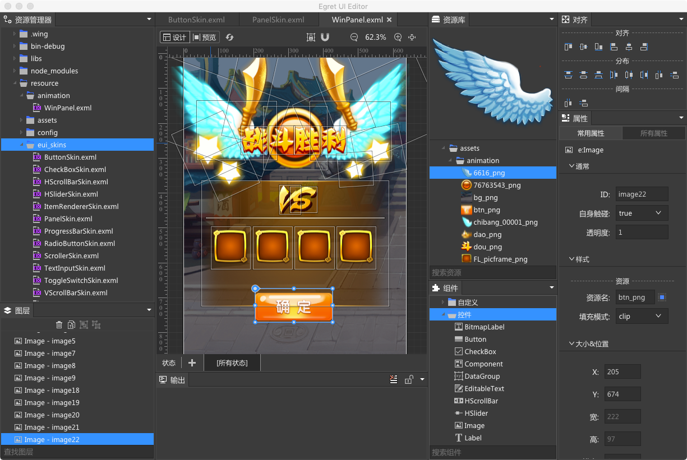

另外：我们建议您在必要时候配合 VSCode 以及 egret coder 插件一起来进行Exml皮肤文件的编辑，以便可以更严谨的控制皮肤内的代码组织结构。
目前仍为alpha版本，后续会做部分调整。

## 构建

```
$ npm run setup-win or npm run setup-mac
$ npm run build
$ npm run start
```

## 项目

Egret UI Editor 是针对 `EUI` 项目进行编辑的。所以请确保您打开的文件夹为一个标准的 `Egret EUI` 项目。

### 项目的打开

- 您可以通过 `VSCode` 中的 `Egret Coder` 插件来打开 `Egret UI Editor`：

	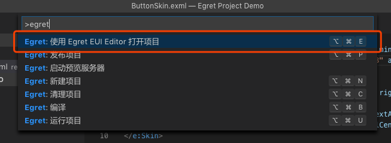

- 或者通过 `Egret UI Editor` 菜单中 `文件` -> `打开文件夹` 的方式打开指定的 `Egret EUI` 项目。

	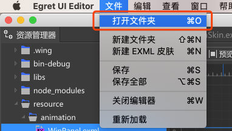


## 界面简介
### 基本布局
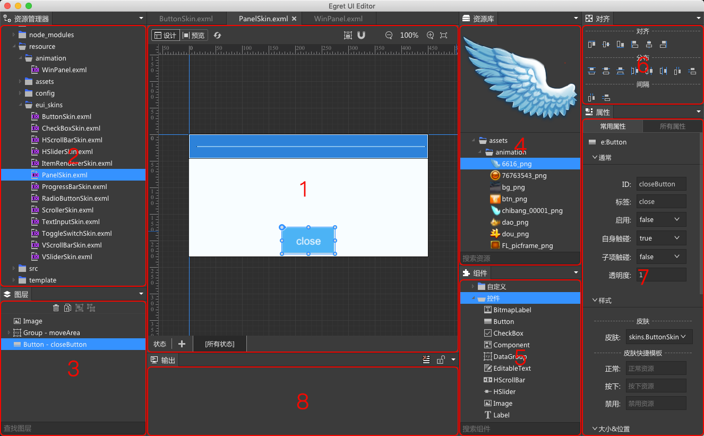
Egret UI Editor的布局直观简单，起包含一下几个主要部分：

- 1 **编辑器**：`Exml` 可视化编辑器的主要区域，您可以通过拖拽标题栏的方式将打开的编辑器组合成自己喜欢的布局。

- 2 **资源管理器**：显示您正在编辑的项目，所在的文件夹内的目录结构，这里对除 `Exml` 以外的文件做了过滤，所以您你能看到 `Exml` 文件和文件夹。另外，如果您在项目的项目的 `egretProperties.json` 中设置了 `exmlRoot` 属性的话，在您的资源管理器面板中，则只会显示 `exmlRoot` 目录内容。

	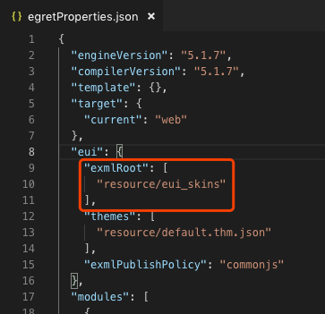

- 3 **图层**：此面板展现的是您当前正在编辑的 `Exml` 皮肤内的节点树状结构，您可以在此面板里更加精准的控制皮肤的层级以及组织结构。

- 4 **资源库**：资源库内展现的是当前您项目的*.res.json内所指定的资源，您可以通过拖拽的方式，将资源作为`UIImage`的填充，直接创建在当前编辑器中。

- 5 **组件**：组件面板中包含 `egret` 引擎自带的所有控件，分为`控件`和`容器`两类，同时也包含用户通过继承 `eui.Component` 开发的自定义组件。（*注意：自定义组件不支持在编辑器中进行渲染，它将会被转为继承的最近的默认组件进行渲染，Egret UI Editor仅支持默认组件的渲染。*）

- 6 **对齐**：当您在编辑器中多选控件之后，即可使用对齐面板进行对齐相关的快捷操作。

- 7 **属性**：对当前编辑器中选中的组件进行属性修改，其中分为 `常用属性` 和 `所有属性` 两类，如果您有需要设置的属性（如自定义组件的自定义属性）在 `常用属性` 中无法找到的话，可以通过 `所有属性` 进行设置。

- 8 **输出**：输出面板中会对当前 `Exml` 皮肤文件的报错进行输出，起输出为引擎报错内容的输出，您可以通过刷新的方式来检查当前皮肤是否还有错误。输出面板的内容不会自动清空，需要您手动进行清除。

## 快速打开文件

您可以通过如下快捷键来唤起快速打开文件的面板 
- win: `Ctrl` + `Shift` + `R`
- mac: `Command` + `Shift` + `R`

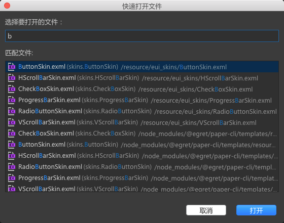

在此面板中，可通过在输入框内输入指定的字符来过滤您想快速打开的文件。同时您可以通过键盘的方向键直接切换所选的要打开的文件。

## 快捷键设置

您可以通过菜单 `Egret UI Editor` -> `首选项` -> `快捷键设置` 来唤起快捷键修改面板：


面板如下：

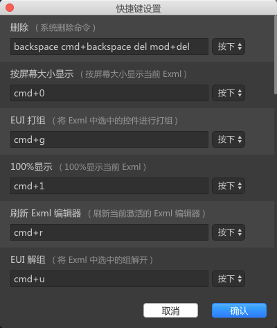

您可以直接通过输入的方式修改快捷键的设置，具体输入内容您可以参考默认快捷键来完成。

## 项目设置

您可以通过菜单 `Egret UI Editor` -> `首选项` -> `EUI项目设置` 来唤起快捷键修改面板：

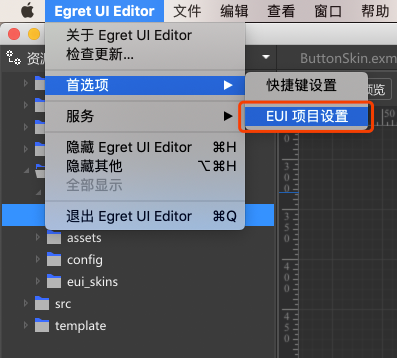

面板如下：

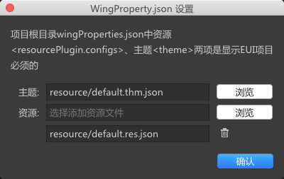

在此面板中您可以设置项目的主题文件以及资源文件。
## 可视化编辑器

### 简介
`Egret UI Editor`可视化编辑器，是针对 `EUI` 项目中的 `Exml` 皮肤进行可视化编辑的编辑器。

该编辑器可以通过可视化的方式更加方便快捷的对 `EUI` 中的 `Exml` 皮肤进行编辑，编辑方式包括但不限于托拉拽等。

### 前置条件
为了可以正常的使用 `Egret UI Editor` ，您的项目需要满足如下几个条件：
- 项目必须为 `Egret EUI` 项目
- 确保您的项目设置（见第五章）是正确的（即`wingProperties.json`文件）。
- 确保指定项目的 `Egret` 引擎版本您已经正确安装。

### 可视化编辑
如果您满足了上述前置条件，即可在 `Egret UI Editor` 中对 `Exml` 皮肤进行可视化编辑了。

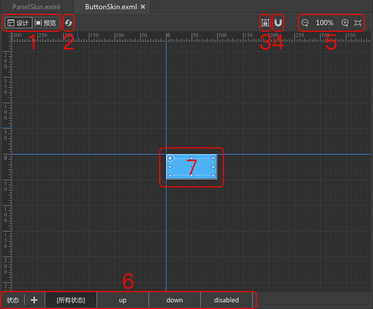

上图所示的为编辑器内的主要部分，其中：
- 1 **视图模式**：视图模式分为`设计`和`预览`两部分。在`设计`视图下您可以通过托拉拽的方式来编辑当前的 `Exml` 皮肤。在`预览`视图下，您可以预览当前皮肤的即使效果。（`预览`视图的详情，我们会在后文中讲解）。

- 2 **刷新**：刷新按钮可以让编辑器这次刷新当前的 `Exml` 皮肤，如果当前的皮肤中存在错误，也会在刷新时通过输出面板展现出来。（其报错内容均为 `Egret` 引擎提供）。

- 3 **拖拽控制**：该按钮可以控制当前选中控件拖拽过程中的如下两种行为：
	- 自动识别经过的容器并拖拽到容器内
	- 仅在当前容器层进行平行移动，不会改变当前控件的层级关系。

- 4 **吸附**：该按钮可以控制拖拽过程，当前控件是否根据所在皮肤其他控件的中线或边线进行吸附对齐。

- 5 **缩放**：对当前可视化编辑的皮肤进行放大或缩小，该功能并不会对皮肤内容进行缩放，进对皮肤展现进行缩放。

- 6 **状态栏**：在具有状态的皮肤中，该状态栏可以控制该皮肤的各种状态，如：按钮的皮肤中包括 `up`, `down`, `disabled` 三种状态，您可以通过状态选择切换状态，并针对皮肤的每个状态分别进行编辑。

- 7 **可视化编辑区**：在该区域中，您可以通过托拉拽的方式自由调整皮肤内容。

### 预览视图

`预览`视图可以预览当前皮肤的效果，其会把当前皮肤中的所有控件在一个真实的 `Egret` 环境中跑起来。所以如果您的皮肤中有按钮等具有交互性质的控件时，其在`预览`视图中是可以进行鼠标交互的。

（*注意：如果您当前皮肤中的控件均不具备交互，其在预览模式下也是无法交互的。如，`button`的皮肤是通过图片与文本组成的，这两个组成部分均不具备交互属性，所以在`预览`视图下按钮的皮肤是无法进行交互的。 但，`panel`的皮肤中其中一个组成部分是按钮，按钮是具备交互属性的，所以在`预览`视图下，`panel`的按钮是可以进行点击的。*）

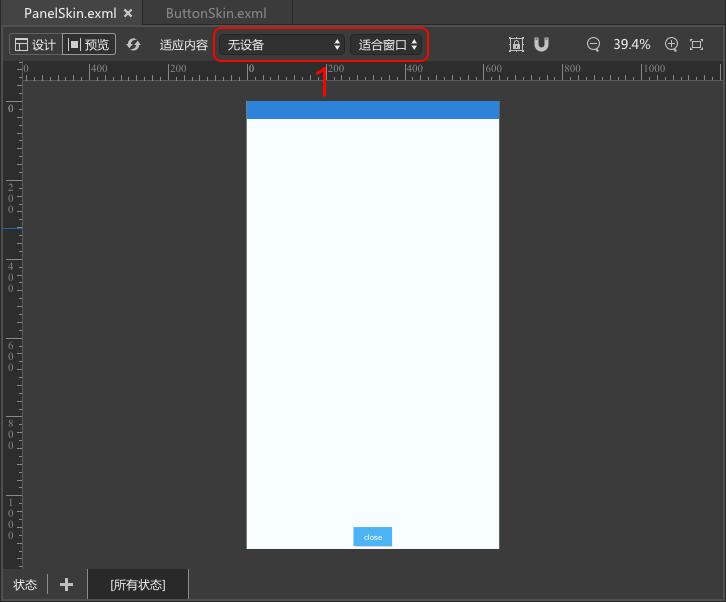

上图所示的为`预览`视图下编辑器内的主要部分，其中：
- 1 **设备与缩放**：您可以选择预览当前皮肤的设备类型，其会改变皮肤的宽度和高度。以及您可以选择当前皮肤展现的缩放程度。

### 设备的适配
皮肤对于指定设备的适配结果是完全遵循当前项目中 `index.html` 内的设置的。如下图所示：

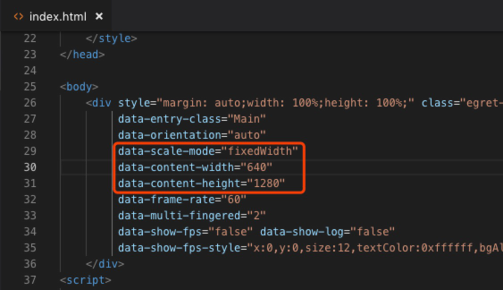

例如：过您想检验一个`面板`皮肤的适配效果，您需要先将`面板`控件在一个新的皮肤中创建出来，并将该控件的皮肤指定为目标`面板`皮肤。（*注意：无法在当前皮肤就是面板皮肤的情况下，对该皮肤进行设备的适配调整*）

如下图皮肤文件所示，为某场景的皮肤代码：

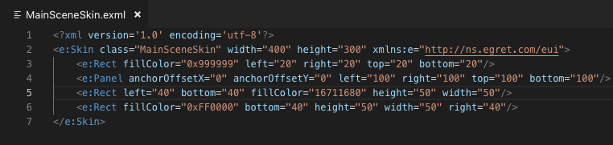

其皮肤展现在`设计`视图中如下图：

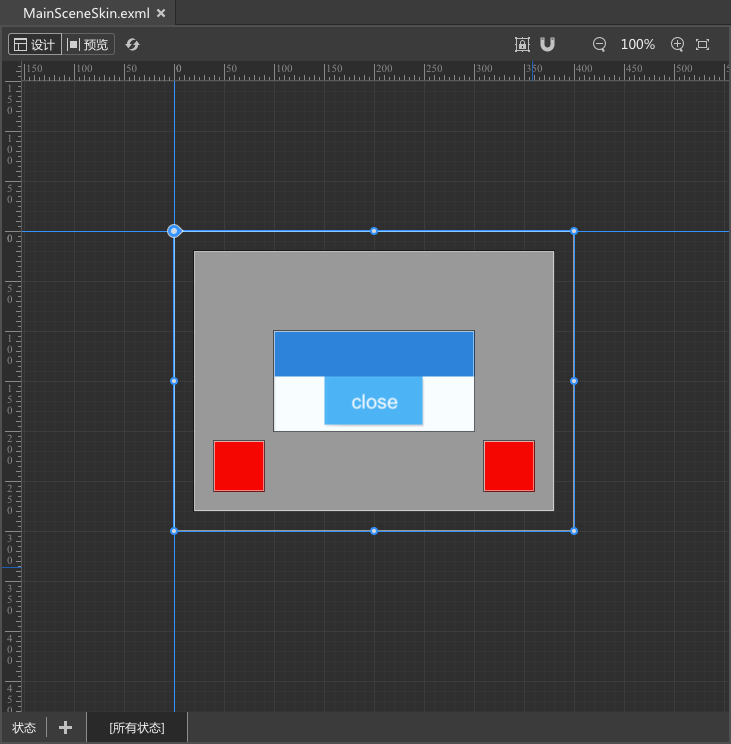

其皮肤的组成结构如下：
- 最底层为一个灰色 `Rect`，其距离四周的边距均为`20`
- 上层为 `Panel`，其距离四周的边距均为`100`
- 最上层为两个红色 `Rect`的方框，分别距离左下角和右下角 `40`

当将视图切换到 `预览` 时其会根据项目中 `index.html` 内的适配策略进行适配，如下图所示 ：

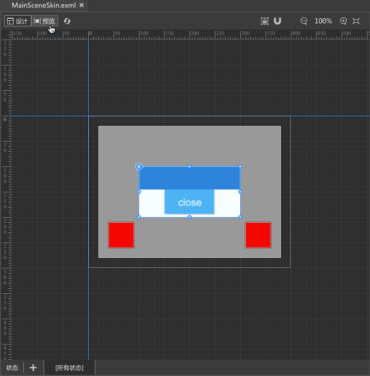

## Egret UI Editor 目录结构

* `build` —— 打包和安装相关的依赖。其中包含部分原生 node 模块已经编译好的部分，在执行 `npm run setup` 的时候会将其拷贝到 `node_modules` 文件夹中。避免 npm install 在不同环境下编译原生node模块失败。
	* `drawin` —— mac 平台打包需要的相关文件，以及 mac 平台的的 `node_modules` 原生模块。
	* `win` —— win 平台打包需要的相关文件，以及 mac 平台的的 `node_modules` 原生模块。
	* `lib` —— tslint 语法检测工具，用于规范开发者书写的代码规范，其中对代码注释做了比较明确的要求。
* `docs` —— 文档相关文件夹
* `euiruntime` —— 运行时相关文件夹，每一个eui编辑器实际上是真实跑了一个 `egret` 环境。这个文件夹中就是这个真实的 	`egret` 环境的 js 文件。
* `libs` —— app 依赖的库，其中目前只有一个盒子布局的库。
* `nls` —— 多语言的配置文件，在编译多语言的时候，会自动生成中文和英文两套多语言。
* `node_modules` —— 安装好的 node 模块。
* `out` —— 编译的输出目录。
* `out-builder` —— app 打包的输出目录。TODO 目前每次打包前会清空该目录，并不会按照版本号保留已经打包好的文件。
* `release-notes` —— 更新日志的记录。
* `resources` —— 部分资源，之所以单独出来是因为在项目中仍有些地方直接在代码中使用了目录，为了方便查找所以独立了出来。但是这部分不应该存在于 `src` 外。 TODO 将此目录中的文件移到src文件夹中，与具体的业务逻辑耦合起来，方便后期维护管理。
* `scripts` —— 常用脚本，目前只有杀掉进程的脚本。 以免下次启动无法在指定端口号进行调试。
* `src` —— 项目的代码目录。
	* `egret` —— 其中包含软件的架构，基础工具，控件和以及业务逻辑。
		* `base` ——  基础结构代码，如常用工具，ui控件，ipc通讯等。
			* `browser` —— UI控件。
			* `common` —— 常用工具。
			* `localization` —— 本地化
			* `parts` —— ipc通讯部分，目前只包含node子进程通讯与渲染进程之间的通讯。
		* `code` —— 程序的主入口部分。
		* `consts` —— 程序内常量，目前仅存储了 APP 名。
		* `editor` —— 编辑器基础架构代码。编辑器主要分了四部分：
			* `input` —— 输入流，用于解析文件为 输入流数据模块。
			* `input-model` —— 输入流数据模块。
			* `editor` —— 分为显示部分 和 编辑器数据层
			* `editor-model` —— 编辑器数据模块，其中包含输入流数据模块
		* `exts` —— 编辑器具体要实现的业务逻辑扩展
			* `exml-exts` —— exml 编辑器相关的业务逻辑具体实现。
		* `parts` —— 部分显示层的控件
		* `platform` —— 编辑器框架层各部分的具体实现，如文件操作，剪切板操作等。
		* `workbench` —— 构建起编辑器显示层的架构。如各面板的具体实现以及编辑器工作台的实现。
	* `typings` —— 部分 `*.d.ts` 的文件声明。
	* `vs` —— 目前仅需要用到原vscode代码中的 `list` `tree` 以及 滚动条控件。

## Egret UI Editor 服务机制

服务机制是整个编辑器架构中，最重要的一部分。其移植自 vscode ，主要功能为提供一系列服务的单例。 在通过 `IInstantiationService` 实例化对象的时候，自动将该对象需要的服务单例注入到该对象中。

### IInstantiationService 描述
`IInstantiationService` 采用树状来管理器内部持有的所有其他服务。

我们可以通过 `IInstantiationService` 的 `createChild` 方法来创建一个子**实例化服务**, 并设置好该**实例化服务**所持有的其他服务。 至此，我们通过这个子**实例化服务**去实例化的对象，就可以自动注入该子**实例化服务**特有的服务了。 

子**实例化服务**所设置的服务，其父级**实例化服务**不持有。 子**实例化服务**在创建的时候会继承其父级**实例化服务**所持有的所有服务。

该实例化方式有效的将项目的服务以来根据业务逻辑拆分为了一个树状结构。

我们在描述一个类的时候，只需要在其构造函数中通过 ts 装饰器的方式描述清楚该类所以来的服务类型即可。

### 其他服务
Egret UI Editor 中包含多个服务，其中部分是框架相关的，另一部分是和 Eui 编辑具体业务逻辑有关的。


#### 框架相关服务
* IInstantiationService - 实例化服务
* IClipboardService - 剪切板服务
* IEnvironmentService - 环境变量服务
* IFileService - 文件服务
* ILifecycleService - 生命周期服务
* INotificationService - 通知服务
* IOperationMainService - 操作服务，主进程使用
* IOperationBrowserService - 操作服务，渲染进程使用
* IStateService - 状态存储服务
* IStorageService - 本地存储服务接口
* IWindowsMainService - 窗体服务，主进程使用
* IWindowClientService - 窗体服务，渲染进程使用
* IWorkspaceService - 工作空间服务
* IWorkbenchEditorService - 工作空间编辑器服务
* IFileModelService - 工作空间文件模块服务

#### Eui 相关服务
* IEgretProjectService - Egret项目服务 


